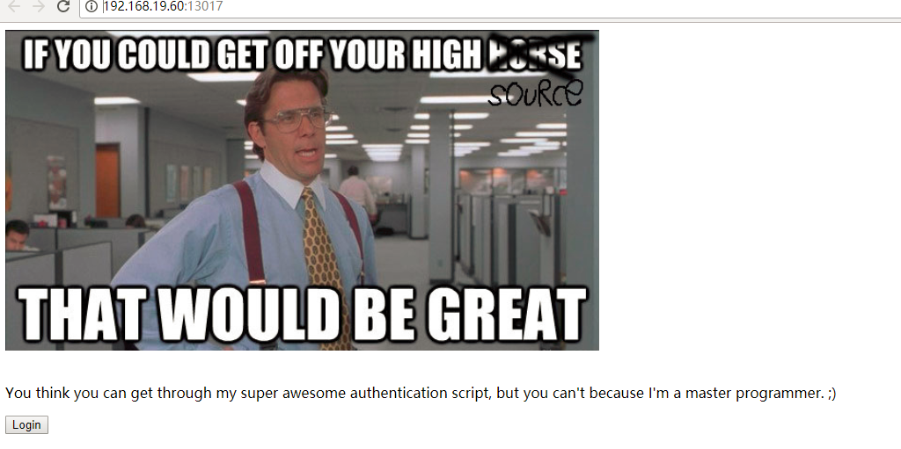
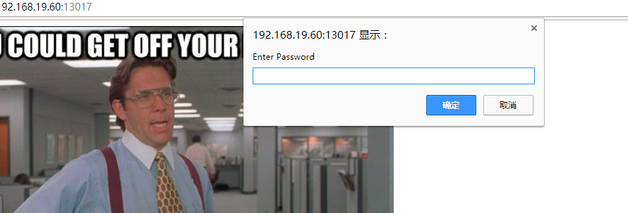
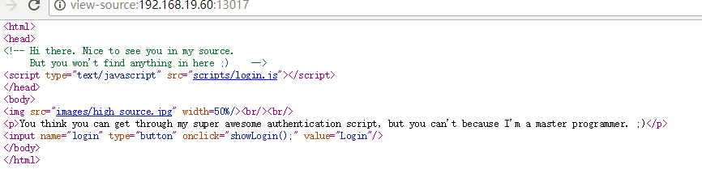

# SJU训练平台
## WEB-签到题
### **【工具】**
chorme
### **【原理】**
代码审计？
### **【步骤】**
1.打开题目链接，让你输密码，感觉应该是输入正确密码得到flag

2.随便瞎输一个密码，会跳转到一个特朗普的表情包

3.查看网页源代码，发现神奇的东西，点进去，然后就得到正确密码了

# Python学习心得一：
emmmm，看上去挺简单的。实际操作起来，emmmm.......
大概能看懂
