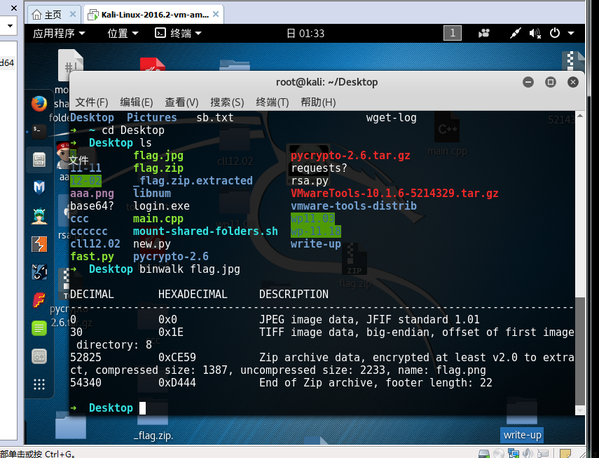
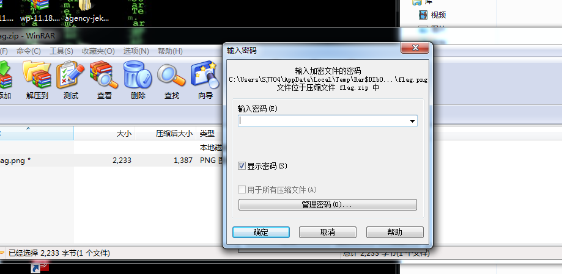
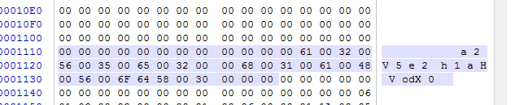
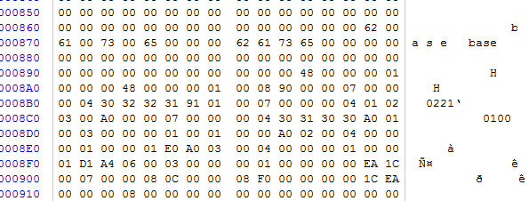
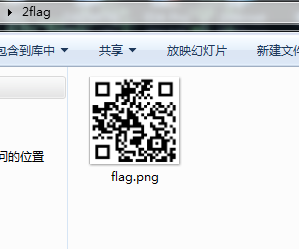

# sju训练平台
## misc 这里有flag
## 【原理】
破解密码 base64
## 【工具】
binwalk winhex base64
## 【解题步骤】
1.打开图片，利用binwalk，发现是zip文件

2.将文件名后缀改为zip，发现被加密

3.利用winhex，打开文件，发现有密码提示，base64解密，得到解压密码，解压后发现是张二维码

 

4.对比一下，发现与正常二维码不同，利用画图工具进行修改，得到flag

