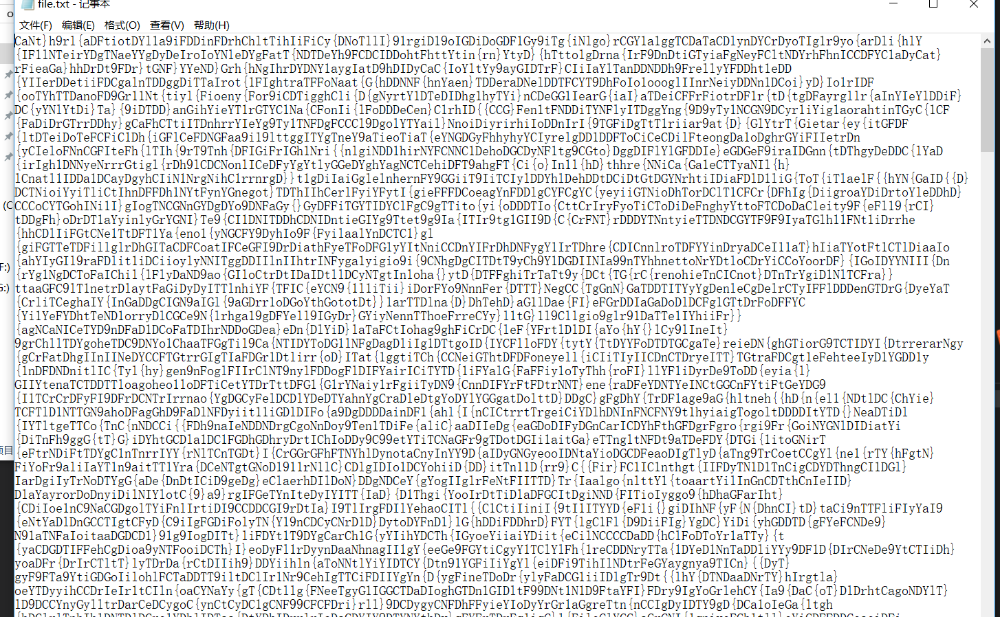

# DDCTF
## misc
### (╯°□°）╯︵ ┻━┻(50)
d4e8e1f4a0f7e1f3a0e6e1f3f4a1a0d4e8e5a0e6ece1e7a0e9f3baa0c4c4c3d4c6fbb9e1b2e2e5e2b5b4e4b8b7e6e1e1b6b9e4b5e3b8b1b1e3e5b5b6b4b1b0e4e6b2fd

### 开始以为MD5解密，发现MD5破解不了。最大值只有f，尝试16进制转文本，发现是乱码。然后无解，实在是不知道咋做了。看了别人wp，原来是16位移码解密，利用脚本进行解密。
### A[注意缩进]
     s='d4e8e1f4a0f7e1f3a0e6e1f3f4a1a0d4e8e5a0e6ece1e7a0e9f3baa0c4c4c3d4c6fbb9e1e6b3e3b9e4b3b7b7e2b6b1e4b2b6b9e2b1b1b3b3b7e6b3b3b0e3b9b3b5e6fd'

    s1=''
    for x in range(len(s)/2):
	    s1+=chr((int(s[x*2:x*2+2],16))%128)
    print s1
    for j in range(20):
        s1=''
        for x in range(len(s)/2):
            s1+=chr((int(s[x*2:x*2+2],16)-j)%128)
        print s1

        
### B [运行出来的flag不一样，不过都是正确的]
    s="d4 e8 e1 f4 a0 f7 e1 f3 a0 e6 e1 f3 f4 a1 a0 d4 e8 e5 a0 e6 ec e1 e7 a0 e9 f3 ba a0 c4 c4 c3 d4 c6 fb b7 b9 b8 e4 b5 b5 e4 e2 b7 b6 b5 b5 b2 e1 b9 b2 b2 e4 b0 b0 e4 b7 b7 b5 e5 b3 b3 b1 b1 b9 b0 b7 fd"

    s=s.split()

    for key in range(0,128+1,1):

    for i in s:

        i = int(i,16)

        print (chr((i + key + 256) % 256 ))
    print (key)
##### DDCTF{798d55db76552a922d00d775e3311907}

     
## 扩展FS(100)

D公司正在调查一起内部数据泄露事件，锁定嫌疑人小明，取证人员从小明手机中获取了一张图片引起了怀疑。这是一道送分题，提示已经在题目里，日常违规审计中频次有时候非常重要。

### 利用binwalk解析图片,再利用foremost分离文件，发现存在一个压缩包,发现解压要密码

    
 
    
查看图片看看有没有隐藏信息，发现有备注，猜是密码.

  
    
### 解压成功，得到一串乱码文本  
    

### 根据题目提示频次，利用脚本，统计出现频率
    import collections

    f=open('file.txt','r')

    print collections.Counter(f.read())

  
    
    Counter({'D': 3950, 'C': 1900, 'T': 1850, 'F': 1800, '{': 1750, 'Y': 1700, 'I': 1650, 'l': 1600, 'i': 1550, 't': 1500, 'a': 1450, 'r': 1400, 'e': 1350, 'N': 1300, 'g': 1250, 'o': 1200, 'h': 1150, 'G': 1100, 'y': 1050, '1': 1000, 'n': 950, '9': 900, '}': 850})
     

