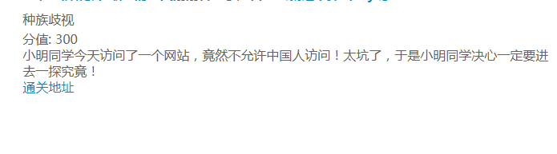
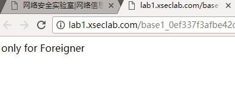
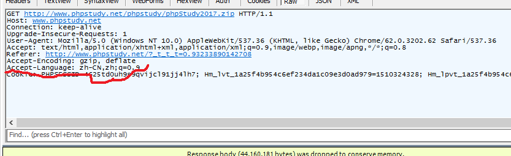
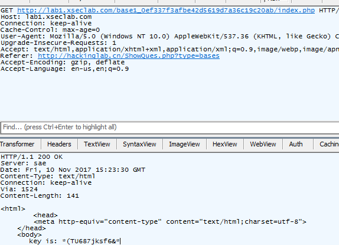
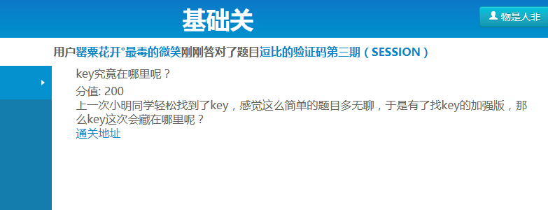
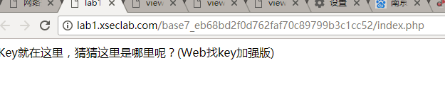
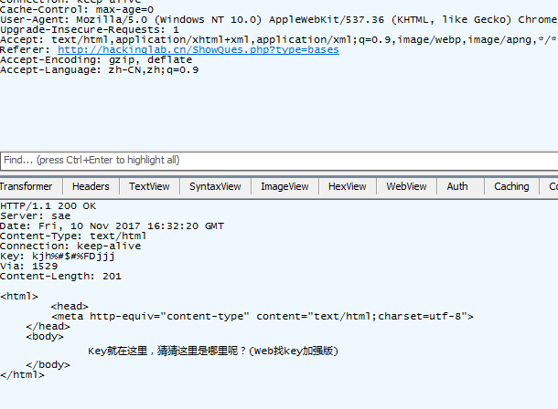
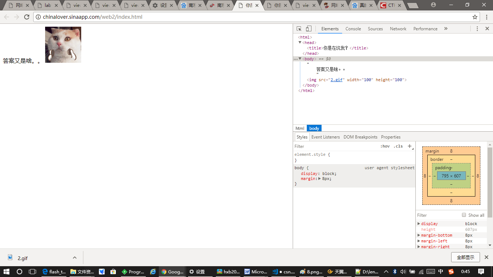
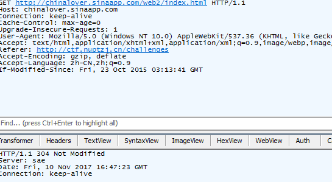
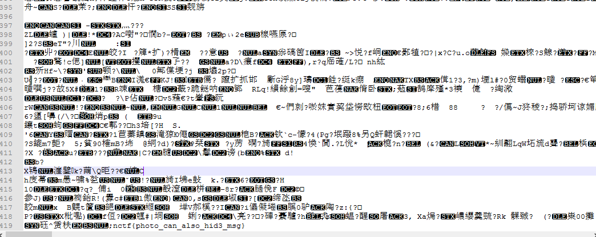

# 网络安全实验室
## 5. 种族歧视
### **【工具】**
fiddler 4 ， chrome
### **【目的】**
学会使用fiddler 4
### **【步骤】**
**步骤一：** 分析题目

打开地址，查看网页源代码，发现啥都没有

 

**步骤二：** 使用工具
打开fiddler 4，发现：Accept-Language: zh-CN，zh

Accept-Language 是HTTP 请求里面的一个属性，用于告诉服务器浏览器可以支持什么语言。 如果网站支持多语种的话，可以使用这个信息来决定返回什么语言的网。题目提示只能外国人，网页源码显示支持中文。只要把Accept-Language 内容改成：en-us，en.就能得到key了。

## 7.key究竟在哪里呢？
### **【工具】**
fiddler 4，chorme
### **【目的】**
熟练掌握fiddler 4
### **【步骤】**
**步骤一：** 分析题目，打开地址.

 

**步骤二：** 打开fiddler 4，点Raw，就能看到key了。

# 南京邮电大学网路攻防训练平台
## 题目：这题不是WEB
### **【工具】**
notepad  , chorme
### **【目的】**
初步接触notepad
### **【步骤】**
**步骤一：**  分析题目，查看网页源码，什么也没有。

**步骤二：** 打开fiddler，也什么都没有，只能从网页上的图片下手了。

**步骤三：** 下载图片，通过百度了解，可以用notepad解决这道题。使用notepad打开这张图,出现一堆乱码，一直看到最后，发现有flag。

notepad++：Notepad++是 Windows操作系统下的一套文本编辑器(软件版权许可证: GPL)，有完整的中文化接口及支持多国语言编写的功能(UTF8技术)。
Notepad++功能比 Windows 中的 Notepad(记事本)强大，除了可以用来制作一般的纯文字说明文件，也十分适合编写计算机程序代码。Notepad++ 不仅有语法高亮度显示，也有语法折叠功能，并且支持宏以及扩充基本功能的外挂模组。

