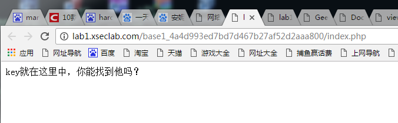
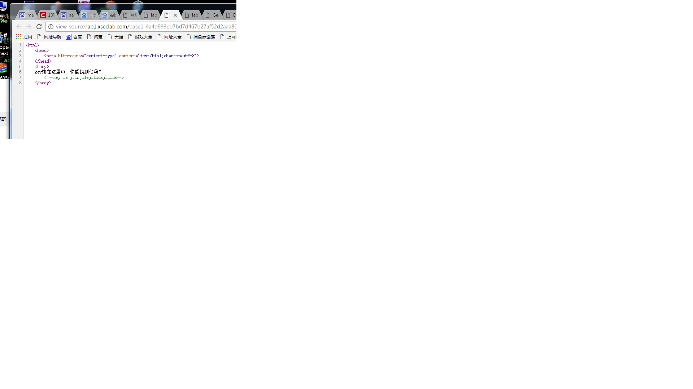
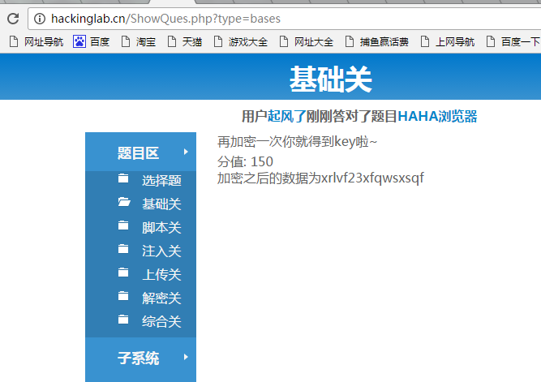
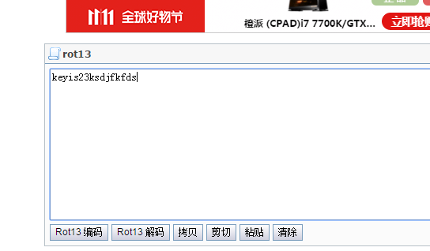
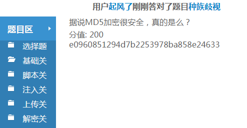
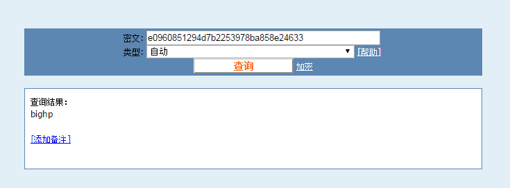
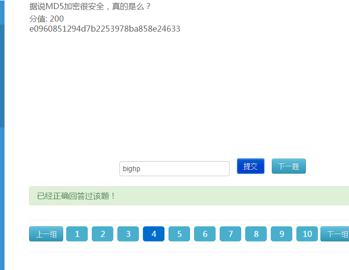

#网络安全实验室
##1.key在哪里？
###**【工具】**
chorm
###**【步骤】**
**步骤一:**分析题目

查看网页源码就能得到flag了

##2.再加密一次你就得到key啦~
###**【工具】**
chorm    
ROT 13在线加密解密器
###**【步骤】**
**步骤一:**分析题目

一串代码，百度一下，是rot13解密
rot13：ROT13（回转13位）是一种简易的替换式密码算法。它是一种在英文网络论坛用作隐藏八卦、妙句、谜题解答以及某些脏话的工具，目的是逃过版主或管理员的匆匆一瞥。ROT13 也是过去在古罗马开发的凯撒密码的一种变体。ROT13是它自身的逆反，即：要还原成原文只要使用同一算法即可得，故同样的操作可用于加密与解密。该算法并没有提供真正密码学上的保全，故它不应该被用于需要保全的用途上。它常常被当作弱加密示例的典型。

应用ROT13到一段文字上仅仅只需要检查字母顺序并取代它在13位之后的对应字母，有需要超过时则重新绕回26英文字母开头即可。A换成N、B换成O、依此类推到M换成Z，然后串行反转：N换成A、O换成B、最后Z换成M（如图所示）。只有这些出现在英文字母里的字符受影响；数字、符号、空白字符以及所有其他字符都不变。替换后的字母大小写保持不变。
**步骤二:**
百度在线解密，就能得到flag了。

##4.据说MD5加密很安全，真的是么？
###**【目的】**
了解md5
##**【工具】**
md5在线加解密
###**【步骤】**
**步骤一：**分析题目

**步骤二：**
百度md5在线加解密

得到bighp，不太像flag，尝试提交

然后对了
